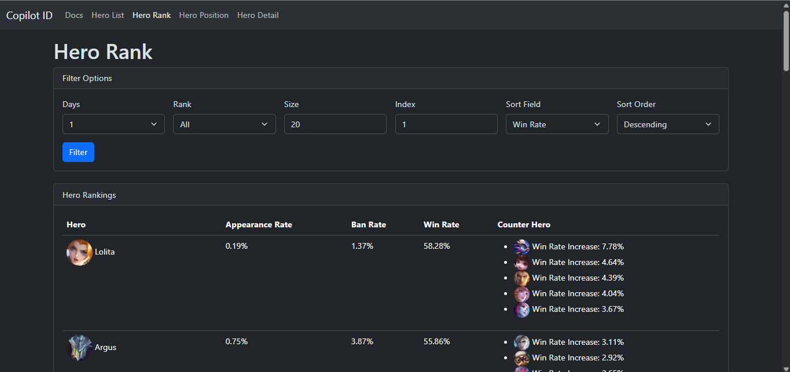

# MLBB Hero Analytics API and Website

[](https://wakatime.com/badge/user/018b799e-de53-4f7a-bb65-edc2df9f26d8/project/6f380e9e-ea7b-4326-8ec2-df979927fe68)

This project provides an API for fetching various analytics and data related to heroes in the game Mobile Legends: Bang Bang (MLBB). The API includes endpoints for hero rankings, positions, details, skill combinations, ratings, relationships, counter information, and compatibility.



## Summary of API Docs, APIs, and Website.

```txt
https://api-mobilelegends.vercel.app/api/"       # for testing an api
https://mlbb-api-docs.vercel.app/"               # for read the documentations easy-to-understand
https://api-mobilelegends.vercel.app/hero-rank/" # for website demo of APIs
```

## Available Endpoints

- Endpoints
  - [Hero Rank](#hero-rank)
  - [Hero Position](#hero-position)
  - [Hero Detail](#hero-detail)
  - [Hero Detail Stats](#hero-detail-stats)
  - [Hero Skill Combo](#hero-skill-combo)
  - [Hero Rate](#hero-rate)
  - [Hero Relation](#hero-relation)
  - [Hero Counter](#hero-counter)
  - [Hero Compatibility](#hero-compatibility)

## Setup

1. Clone the repository:

   ```bash
   git clone https://github.com/ridwaanhall/api-mobilelegends.git
   cd api-mobilelegends
   ```

2. Create a virtual environment and activate it:

   ```bash
   python -m venv venv
   source venv/bin/activate  # On Windows use `venv\Scripts\activate`
   ```

3. Install the dependencies:

   ```bash
   pip install -r requirements.txt
   ```

4. Set up your Django settings:
   - Update the `MLBB_URL` in your `settings.py` file with the appropriate URL.

5. Run the Django development server:

   ```bash
   python manage.py runserver
   ```

## Usage

Use the provided endpoints to fetch various analytics and data related to heroes in MLBB. Refer to the Endpoints section for detailed information on each endpoint and how to use them.

## License

This project is licensed under the MIT License. See the LICENSE file for more details.
