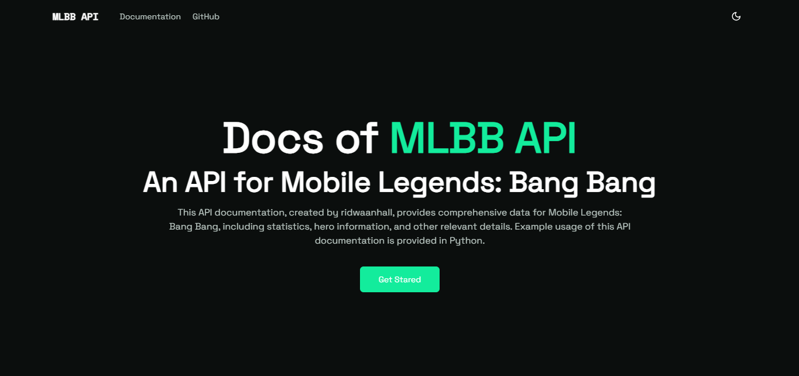
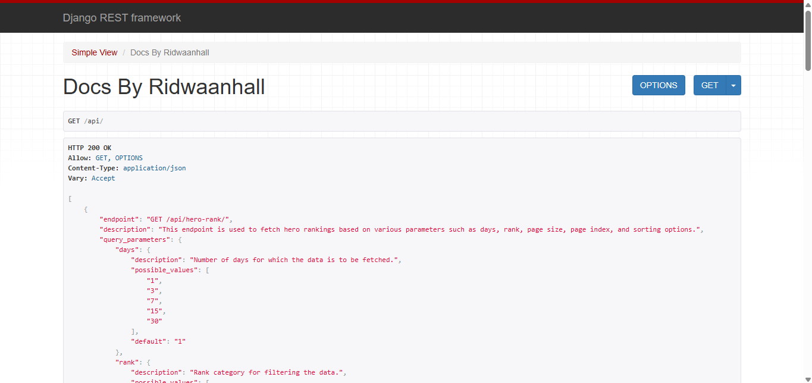

# MLBB Hero Analytics API and Website

## 🌟 Your Support Means the World! Start from 1 USD

Are you interested in the project I created and want to help keep it running? You can support me by becoming a sponsor! Your contributions will greatly assist in the development and maintenance of this project.

[](https://github.com/sponsors/ridwaanhall/)

Thank you for supporting my work! Together, we can create something amazing. 🚀

## Description

[](https://wakatime.com/badge/user/018b799e-de53-4f7a-bb65-edc2df9f26d8/project/6f380e9e-ea7b-4326-8ec2-df979927fe68)

This project provides an API for fetching various analytics and data related to heroes in the game Mobile Legends: Bang Bang (MLBB). The API includes endpoints for hero rankings, positions, details, skill combinations, ratings, relationships, counter information, and compatibility.

## Summary of Base URL, API Docs, APIs, and Website

```txt
https://mlbb-stats.ridwaanhall.com/                # base url
https://mlbb-stats-docs.ridwaanhall.com/           # documentations easy-to-understand
https://mlbb-stats.ridwaanhall.com/api/            # testing an api
https://mlbb-stats.ridwaanhall.com/hero-rank/      # for website demo of APIs
```

## Discussion

If you have any questions or would like to discuss this project, please join the conversation in our [GitHub Discussions](https://github.com/ridwaanhall/api-mobilelegends/discussions). We value your feedback and are here to help!

## Interfaces

### API Docs with Explanations and Example Usage

[https://mlbb-stats-docs.ridwaanhall.com/](https://mlbb-stats-docs.ridwaanhall.com/)



### Testing an API [Click here](https://mlbb-stats.ridwaanhall.com/api/)



### Demo Website [Click here](https://mlbb-stats.ridwaanhall.com/hero-rank/)


## Available Endpoints

- Endpoints
  - Hero Rank
  - Hero Position
  - Hero Detail
  - Hero Detail Stats
  - Hero Skill Combo
  - Hero Rate
  - Hero Relation
  - Hero Counter
  - Hero Compatibility

## Usage

Use the provided endpoints to fetch various analytics and data related to heroes in MLBB. Refer to the Endpoints section for detailed information on each endpoint and how to use them.

## License
This project follows the **BSD 3-Clause License**. Please refer to [LICENSE](https://github.com/ridwaanhall/api-mobilelegends/blob/main/LICENSE) for details.

## Attribution
Special thanks to **Moonton** for developing **Mobile Legends: Bang Bang**. All rights to the game and its assets belong to **Moonton**.

## Source
For more information about **Mobile Legends: Bang Bang**, visit the official website: [Mobile Legends](https://www.mobilelegends.com).

## Disclaimer

This project is an independent redistribution of the **Mobile Legends: Bang Bang API** developed by **Moonton**. The purpose of this project is to make accessing the API easier through custom code and implementation.

By using this code, you **must** adhere to the following conditions:

1. **License Compliance** – Users must follow the **BSD 3-Clause License** terms, including proper attribution and distribution policies. See [LICENSE](https://github.com/ridwaanhall/api-mobilelegends/blob/main/LICENSE) for details.
2. **Attribution Requirement** – Users **must** mention both:
   - **Moonton** as the developer and publisher of **Mobile Legends: Bang Bang**.
   - **ridwaanhall** as the creator of this MLBB Stats.
3. **Visibility of Attribution** – The attribution to **Moonton** and **ridwaanhall** must be clearly visible in any public-facing project or website that utilizes this API.
4. **Independent Project** – This project is **not affiliated, endorsed, or officially supported** by **Moonton**. All rights to **Mobile Legends: Bang Bang** and its assets belong to **Moonton**.

Failure to comply with these terms may result in **restriction from using this code**.

For more information, please visit [Mobile Legends](https://www.mobilelegends.com/) and [ridwaanhall’s GitHub](https://github.com/ridwaanhall/api-mobilelegends).
