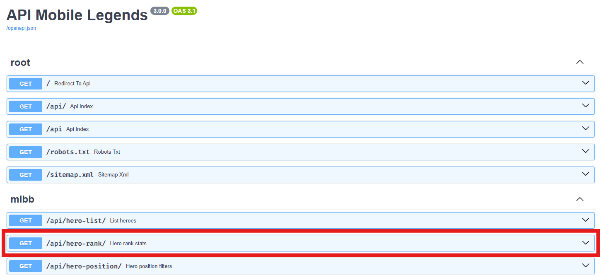
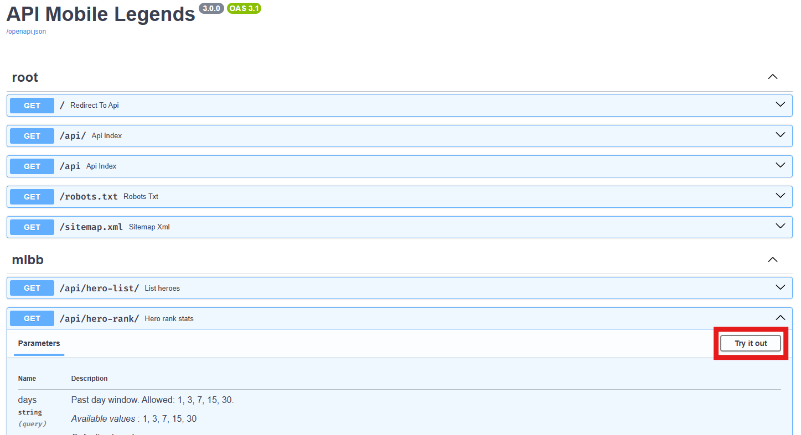
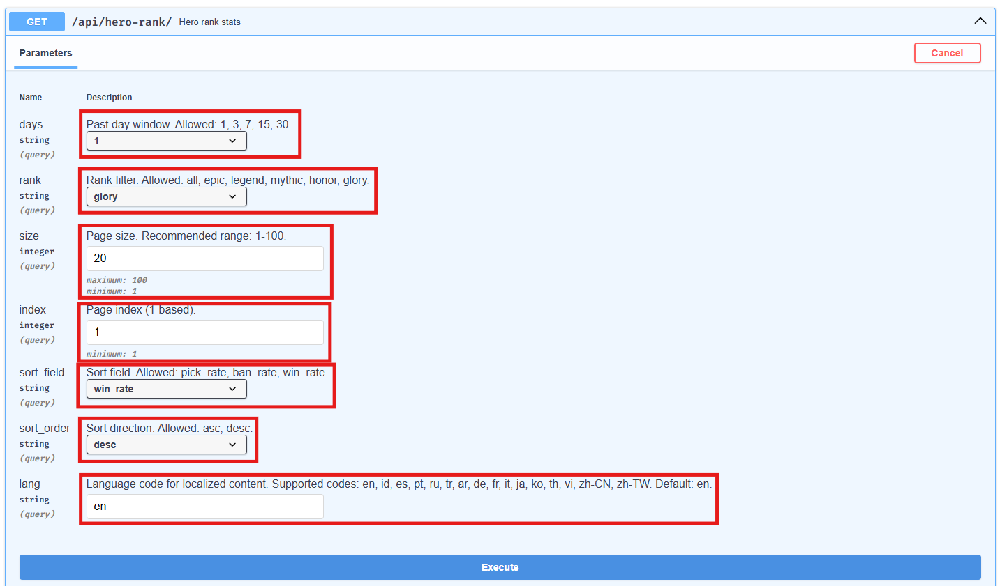
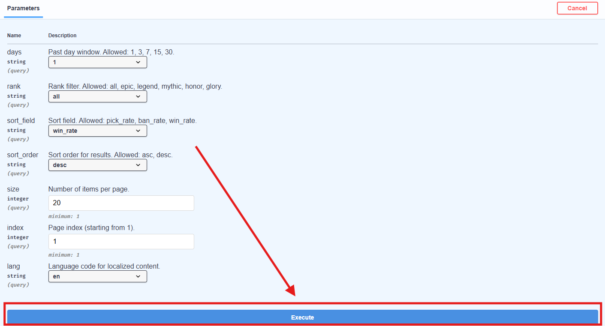
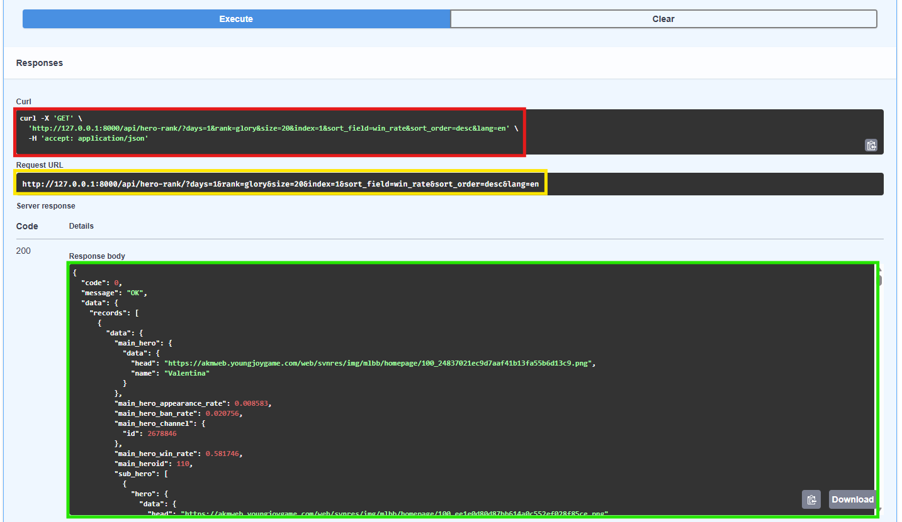

# Mobile Legends Public Data API (MLBB + Academy)

Production API service that provides Mobile Legends data endpoints for analytics, hero insights, and academy content.

## What The API Can Do

- Provide MLBB hero listings, rank performance, role/lane filters, matchup data, and win-rate utilities.
- Provide MLBB Academy resources including heroes, roles, equipment, emblems, spells, guides, trends, and ratings.
- Expose interactive API documentation for direct request testing in browser.
- Return standardized error payloads for validation and service-level failures.

## Documentation

- Swagger UI: `/docs`
- ReDoc: `/redoc`
- Swagger alias: `/api/docs`

## Available URLs

```txt
https://mlbb-stats.rone.dev                # root (redirects to /docs)
https://mlbb-stats.rone.dev/api            # API index and endpoint map
https://mlbb-stats.rone.dev/docs           # Swagger UI
https://mlbb-stats.rone.dev/redoc          # ReDoc
https://mlbb-stats.rone.dev/api/docs       # Swagger alias (redirects to /docs)
https://mlbb-stats.rone.dev/robots.txt
https://mlbb-stats.rone.dev/sitemap.xml
```

## Example Usage in FastAPI

1. Visit [mlbb-stats.rone.dev/docs](https://mlbb-stats.rone.dev/docs)

2. Open any API (example: `/api/hero-rank`)
   
   *Note: If clicking does not work, try expanding the dropdown.*

3. Click **Try it out**
   

4. Fill in the required data (or leave defaults if support)
   

5. Click **Execute**
   

6. You will see a response like this:
   
   - **Red box**: `curl` code to fetch data
   - **Yellow box**: Request URL to directly test the API
   - **Green Box**: The actual API output

## API Coverage

### MLBB API

- `GET /api/hero-list`
- `GET /api/hero-rank`
- `GET /api/hero-position`
- `GET /api/hero-detail/{hero_id_or_name}`
- `GET /api/hero-detail-stats/{hero_id_or_name}`
- `GET /api/hero-skill-combo/{hero_id_or_name}`
- `GET /api/hero-rate/{hero_id_or_name}`
- `GET /api/hero-relation/{hero_id_or_name}`
- `GET /api/hero-counter/{hero_id_or_name}`
- `GET /api/hero-compatibility/{hero_id_or_name}`
- `GET /api/win-rate?match-now=&wr-now=&wr-future=`

### MLBB Academy API

- `GET /api/academy/version`
- `GET /api/academy/heroes`
- `GET /api/academy/roles`
- `GET /api/academy/equipment`
- `GET /api/academy/equipment-details`
- `GET /api/academy/spells`
- `GET /api/academy/emblems`
- `GET /api/academy/recommended`
- `GET /api/academy/recommended/{recommended_id}`
- `GET /api/academy/guide`
- `GET /api/academy/guide/{hero_id}/stats`
- `GET /api/academy/guide/{hero_id}/lane`
- `GET /api/academy/guide/{hero_id}/time-win-rate/{lane_id}`
- `GET /api/academy/guide/{hero_id}/builds`
- `GET /api/academy/guide/{hero_id}/counters`
- `GET /api/academy/guide/{hero_id}/teammates`
- `GET /api/academy/guide/{hero_id}/trends`
- `GET /api/academy/guide/{hero_id}/recommended`
- `GET /api/academy/hero-ratings`
- `GET /api/academy/hero-ratings/{subject}`

## Configuration

Required variables:

- `SECRET_KEY`
- `MLBB_URL`
- `MLBB_URL_V2`

See `.env.example` for full environment options.

## Changelog

Migration notes are documented in [Releases](https://github.com/ridwaanhall/api-mobilelegends/releases).

## License

This project is released under the BSD 3-Clause License. Attribution to Moonton and ridwaanhall should be preserved in downstream usage.

---

## Local Development (for ridwaanhall only)

1. Install dependencies.

   ```bash
   pip install -r requirements.txt
   ```

2. Create environment file.

   ```bash
   cp .env.example .env
   ```

3. Tests

   ```bash
   pytest
   ```

4. Run FastAPI.

   ```bash
   uvicorn app.main:app --reload
   ```
