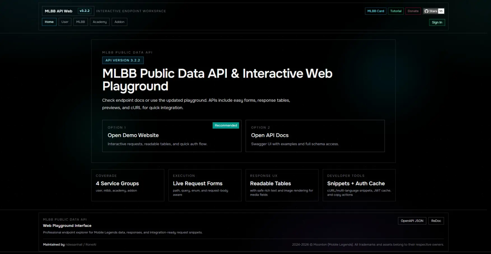

# MLBB Public Data API & Web

[](https://mlbb.rone.dev)




This API & Web provides access to hero analytics, in-game performance data, academy resources, player endpoints, and utility tools. It is designed with a consistent RESTful structure, supports flexible hero identifiers (ID or name), and delivers standardized responses for seamless integration into applications, dashboards, analytics systems, and internal tooling.

> [!IMPORTANT]
> **Built with Dedication:** This project is the result of over [](https://wakatime.com/badge/user/018b799e-de53-4f7a-bb65-edc2df9f26d8/project/07151d3c-c9e1-4f53-bb7f-f706f8261ac4) of meticulous coding, architecting, and performance tuning to ensure the best developer experience.

## Features

- **Public REST API for MLBB data**: user, mlbb, academy, and addon service groups
- **Web playground for all endpoints**: form-driven execution at `/web/*`
- **Flexible hero identifier support**: hero ID or hero name (including compact slug-like names)
- **Readable response views**: switch between Key-Value and Key-As-Header table modes
- **Language snippets**: curl, python, javascript, go, node, php, java, csharp
- **Copy helpers**: copy snippet, copy response, copy JWT from signed-in menu
- **Auth modal flow for user endpoints**: Send VC + Login in one popup
- **JWT-aware navbar state**: profile photo, username, country, roleId(zoneId), sign out
- **Tutorial & blog pages**: step-by-step guides with SEO-ready detail pages
- **OpenAPI-first docs**: Swagger UI, ReDoc, and OpenAPI JSON

## Documentation

- Website home: `https://mlbb.rone.dev`
- Tutorial & Blog: `https://mlbb.rone.dev/blog`
- Web Playground: `https://mlbb.rone.dev/web`
- Swagger UI: `https://mlbb.rone.dev/api/docs`
- ReDoc: `https://mlbb.rone.dev/api/redoc`
- OpenAPI JSON: `https://mlbb.rone.dev/api/openapi.json`

### Web Interface Highlights

- Home page provides two entry points: **Open Demo Website** and **Open API Docs**
- Demo Website (`/web/*`) is recommended for most usage and exploration
- Sign In modal supports **Send VC** then **Login with VC** (same role/zone fields, VC expires in 5 minutes)
- Signed-in menu shows profile details and **Copy JWT** for quick docs authorization
- Endpoint cards include request forms, snippets, readable/JSON responses, and copy actions
- Readable response section supports view switching: **Key-Value** or **Key As Header**

## Base URLs

```txt
https://mlbb.rone.dev/                  # Landing page
https://mlbb.rone.dev/blog              # Tutorial and blog list
https://mlbb.rone.dev/blog/{slug}       # Blog detail page
https://mlbb.rone.dev/web               # Web interface (redirects to /web/user)
https://mlbb.rone.dev/web/user          # User endpoints playground
https://mlbb.rone.dev/web/mlbb          # MLBB endpoints playground
https://mlbb.rone.dev/web/academy       # Academy endpoints playground
https://mlbb.rone.dev/web/addon         # Addon endpoints playground
https://mlbb.rone.dev/api               # API index/status
https://mlbb.rone.dev/api/docs          # Swagger UI
https://mlbb.rone.dev/api/redoc         # ReDoc
https://mlbb.rone.dev/api/openapi.json  # OpenAPI schema
```

## API Coverage

Full endpoint lists, operation summaries, and request/response schemas are always available in:

- `https://mlbb.rone.dev/api/docs` (Swagger UI)
- `https://mlbb.rone.dev/web` (interactive web endpoint explorer)

This ensures API coverage documentation stays up to date with every release without maintaining manual endpoint lists in README.

## Changelog

See [Releases](https://github.com/ridwaanhall/api-mobilelegends/releases) for migration notes and updates.

## License & Attribution

This project is licensed under the **BSD 3-Clause License**.
Attribution must be preserved to **Moonton (the creator of Mobile Legends)** and either
**ridwaanhall (the maintainer of this API project)** *or*
**RoneAI (the organization behind this API)** in all downstream usage and derivative projects.

### Notice

All data is sourced from publicly available content and provided for educational, analytical, and community purposes only.
Visual assets and references are used respectfully and do not imply official partnership.

### Example Attribution (README or app footer)

> Powered by MLBB Public Data API
> Data © Moonton (Mobile Legends)
> API maintained by ridwaanhall / RoneAI

<details>
<summary>Local Development (internal)</summary>

### Setup

```bash
# skip this if already have
uv init # create pyproject.toml
uv add fastapi # add deps
uv add pytest --dev # add deps for dev

# use this if already have pyproject.toml and uv.lock
uv sync
cp .env.example .env
```

### Run

#### Development

```bash
fastapi dev
```

#### Production

```bash
fastapi run
```

#### Deploy

```bash
fastapi deploy
```

### Test

```bash
pytest
```

### Environment Variables

- `SECRET_KEY`
- `RONE_DEV_ACCESS_KEY`
- `RONE_DEV_ACCESS_KEY_V2`

See `.env.example` for full configuration.

</details>
